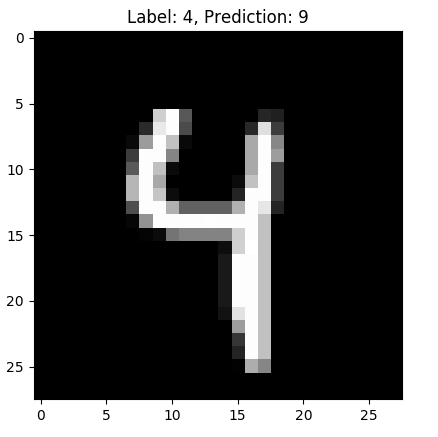

# Course in machine learning (ML)
A simple introduction to text classification with machine learning. The course will cover some elementary linguistic morphology techniques for extracting features, and an introduction to some classifiers.

The tasks in this course will be solved in **Python 3** with the **scikit-learn** tool. 

__Tasks__:
1. Creating a spam-filter
2. Sentiment analysis of movie reviews

> **Prerequisites**: Some *Python*

### Document classification/categorization
The process is to assign a document to one or more classes or categories. The documents may be texts, images, music, etc. One of the most common types of document classification is text classification. 

* **Content-based** classification is classification in which the weight given to particular subjects in a document determines the class to which the document is assigned. It could be the number of times given words appears in a document.
* **Request-oriented** classification (or indexing) is classification in which the anticipated request from users is influencing how documents are being classified.

### Linguistic morphology 
Before we can use the data set, we have to extract the features we want to use. There are several ways to extract these features. Some normal techniques are:

1. **Tokenization** is the process of delimiting a string of input characters. The resulting tokens are then passed on to some other form of processing.  
E.g. `The quick brown fox jumps over the lazy dog => [the, quick, brown, fox, jumps, over, the, lazy, dog]`
2. **Stemming** is the process of reducing inflected (or sometimes derived) words to their word stem, base or root form.  
E.g. `cats, catlike, catty => cat`, or the special form where the stem is not itself a word `argue, argued, argues, arguing => argu`
3. **Lemmatization** is the process of grouping together the inflected forms of a word so they can be analysed as a single item, identified by the word's lemma, or dictionary form.  
E.g. `am, are, is => be`
4. Removing **stop words** is a way to remove irrelevant data. Any group of words can be chosen as the stop words for a given purpose. This means that stop words are the words that don't provide any context for the given task at hand.  
E.g. `a, and, as, at, in, the`
5. The **bag-of-words** (BoW) model is used to look at the frequency of each word in a document. All words in the corpus (text samples) form a dictionary.  
E.g.: The dictionary `["John", "likes", "to", "watch", "movies", "Mary", "too", "also", "football", "games"]` 
applied to the text `John likes to watch movies. Mary likes movies too.` will form the vector `[1, 2, 1, 1, 2, 1, 1, 0, 0, 0]`. 

### Choosing the right estimator
We want to make a model that predicts a class for different text examples. For simplicity we have chosen data sets with binary classification (e.g. spam/ham). 

For choosing the right estimator we can use scikit's estimator chooser:


## Setup
Please `git clone` this repo before you do anything else.

All you need to complete these tasks is included with Anaconda. If you are on linux you can also just create a virtual environment and install the required packages.

If you need a decent IDE for python (no IDE wars please), get the [Pycharm Community Edition](https://www.jetbrains.com/pycharm/).

Some of the code may require the latest version of Anaconda, so please re-install or upgrade if you are on an old version.
### Windows
[Install Anaconda](https://www.anaconda.com/download/#download).

### Linux/MacOS

#### opt 1 - install anaconda

[Install Anaconda](https://www.anaconda.com/download/#download).

#### opt 2 - install requirements
```bash
python3 -m venv env
source env/bin/activate
pip install -r requirements.txt
```
> **Note:** you may have to install `venv` separately.

If you are using pycharm, it would now be a good idea to set the python interpreter from anaconda as the [project interpreter](https://www.jetbrains.com/help/pycharm/project-interpreter.html).

## Tasks
Execute the `main.py` script with `python main.py`.

If you are getting an error here like `No module named 'sklearn'`, make sure you are running it with the python install/environment we set up earlier. If it still fails go back to the setup part or get help from an instructor.

### 1. Spam filter
file: [spam_filter.py](tasks/spam_filter.py)

In this task we are going to classify a SMS as either spam or ham. The data set is labeled with 0 (ham) and 1 (spam).

The task is to implement the two functions:
```python
def feature_extraction(data_set: iter) -> iter:
```
In this function you are supposed extract the features used to train the classifier. 
> **Tip:** Use some of the linguistic morphology techniques mentioned above.

```python
def init_classifier():
```
Initiate a scikit-learn estimator. 
> **Tip:** Optimize hyper-parameters for the estimator (e.g. [GridSearch](http://scikit-learn.org/stable/modules/generated/sklearn.model_selection.GridSearchCV.html#sklearn-model-selection-gridsearchcv)).

__Data set__:

You can have a look at the data in the [sms csv file.](files/spam_data/sms_source.csv)
Do not click any links in the text. They are spam, and may be bad for your health.

Spam     | SMS 
-------- | ----------------------------------------------------------------------------------
0        | Fair enough, ...
1        | Did you hear about ...

### 2. Sentiment analysis of movie reviews
file: [sentiment_analysis.py](tasks/sentiment_analysis.py)

The data set includes multiple columns. For a simple binary classifier we could use the positive/negative label, but that is too easy. We are going to predict the exact score of the review. Here we are going to measure how well you are doing with Root Mean Squared Error. RMSE is a measure of how much, on average, your predictor is missing the target score.

As we did in the last task we _could_ use a _classifier_. However, this would then be a so-called multiclass classification problem. If we instead want make use of the fact that the problem is predicting a score on a linear scale it would be smart to instead think of this as a regression problem. There are examples of _regressors_ in the model selector we looked at earlier. 

Instead of providing you with all the glue code you are going to build a pipeline. Think of a pipeline as a chain of transformers that mold the data, followed by an estimator that learns and predicts based on the earlier transformers. Pipeline docs for the curious: [docs](http://scikit-learn.org/stable/modules/generated/sklearn.pipeline.Pipeline.html).

We have given you a simple starting pipeline with a dummy transformer and regressor. Feel free to change those as you see fit, or use the transformers and estimators provided by scikit learn.

__Data set__:

You can have a look at the data in the [review csv file.](files/review_data/review_source.csv).

Positive | Rating  | Review 
-------- | ------- | -------------------------------------------------------------------------
1        | 10      | A nicely done thriller with plenty of ...
0        | 2       | This film just goes around in circles ... 


## Extra tasks
Execute the `extra.py` script with `python extra.py`.

### 1. Number classification
file: [number_classifier.py](tasks/number_classifier.py)

In this extra task we want to classify bitmaps to numbers. Each bitmap is represented by a 1d-array.
 
The task is to implement the two functions:
```python
def feature_extraction(data_set: iter) -> iter:
def init_classifier():
```

When running the `extra.py` script, you will get printed the wrongly classified numbers. 

As seen here:   

